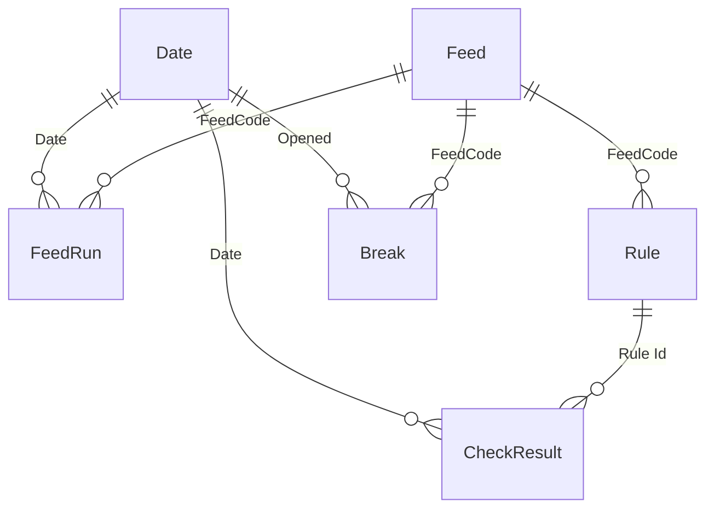

# Data Reconciliation Monitor

A working Power BI data-quality report: the morning check a data platform team runs before the business opens its dashboards - did last night's loads land, does the warehouse match the source systems, and which breaks need chasing. Built as a PBIP project, so the semantic model and DAX are readable here on GitHub.

> All data is synthetic and the client (Thornfield Retail Group, a multi-channel retailer) is fictional. Every figure traces to the deterministic generator in [`generator/`](generator/).

## What it answers

| Page | Question |
|---|---|
| Morning Check | Did last night's run land clean, and what needs attention today? |
| Reconciliation | Does the warehouse match the source, feed by feed, pairwise? |
| Quality Rules | Once the data is in, is it fit to use? The rulebook across the five quality dimensions. |
| Break Register | Every unresolved discrepancy, owned and aged - the team's queue. |
| Feed Detail | One feed end to end (drillthrough). |

The report is fixed to the run of Monday 29 June 2026, so the published numbers are stable; a Run date slicer walks back through the 90 nights of history.

## The two ideas that run through it

**1. The facts are measurements about data, not the data itself.** The model does not re-store 4.65 million POS rows; it stores that last night's POS extract had 2,412,384 rows at source and 2,412,384 landed, with matching amount totals. Around 4,700 fact rows describe the movement of millions of source rows a night. This is how a real reconciliation monitor works - a metadata store - and it keeps every headline an honest aggregation of stored measurements.

**2. Verdicts are computed, never stored.** The generator writes only raw observations - row counts, amount totals, rows failing a rule, minutes late. Pass / warn / fail is derived in DAX by comparing those against the thresholds held on the Rule table. Change a tolerance in the Rule table and every verdict, colour and KPI re-derives. One `Verdict Colour` measure drives the traffic discipline everywhere: green means a check passed, red means it failed or a break is open, amber means inside tolerance but worth a look - and nothing else ever borrows those colours.

## Data model

A star schema of three dimensions and three facts, plus a disconnected run-date selector.

| Table | Grain | Rows |
|---|---|---|
| Feed Run | Feed x scheduled night: pairwise counts, amounts, files, arrival | 681 |
| Check Result | Rule x scheduled night: units checked, units failed, minutes late | 4,049 |
| Break | One discrepancy raised (14 still open at 29 Jun) | 68 |
| Date / Feed / Rule | dimensions (Date marked as a date table) | 91 / 8 / 48 |
| Run Date | disconnected run-date selector | 90 |

**Run Date** is a disconnected table: the Run date slicer binds to it, so the real Date table stays free for the trailing 14- and 30-night trend axes while every "as at the selected night" measure reads a single `Run Anchor`. **Break** carries a second, inactive relationship to Date on its resolved date, activated inside the mean-time-to-resolve measures. Full spec: [`docs/spec-data-reconciliation.md`](../docs/spec-data-reconciliation.md).

## Measures

~57 measures. Highlights:

- **Check Verdict / Feed Verdict** - pass/warn/fail derived from the Rule thresholds (fail rate, minutes late, missing files); the feed's verdict is the worst of its load checks, so an in-warehouse rule warning never turns the status board amber.
- **Row Match Rate %, Row/Amount Delta** - pairwise reconciliation; a matched feed reads 0, not blank, and a non-monetary feed reads a dash, not zero.
- **Dimension Pass Rate %** - share of rule-night evaluations passing over the trailing 30 nights, counted per evaluation so a rule added mid-window does not depress history it was never part of.
- **Open Breaks, Break Age Days, Mean Time To Resolve** - the register judged as at the selected night (time-travelling, not a snapshot), with MTTR flowing through the inactive resolved-date relationship.
- **Verdict Colour / Severity Colour** - the single conditional-format measures behind the whole traffic-light palette.

## Deliberate data-quality wrinkles

Six realistic issues - this time in the monitoring data itself - handled in the open:

| Wrinkle | Handling |
|---|---|
| No-run nights (weekday-only and Mon-Sat feeds) | Schedule-aware: a missing night reads "No run", never a failure, and stays out of every pass-rate denominator |
| A reprocessed night wrote duplicate check results | Keep-latest on the run sequence in Power Query |
| A rule added mid-window | Pass rates count actual evaluations, not nights x rules |
| Inconsistent arrival-time formats from one source | Normalised to HH:MM in a named Power Query step, raw value preserved |
| A break resolved before it opened | Flagged by a measure, excluded from MTTR, left visible in the register |
| Feeds with no monetary measure | Amount columns genuinely blank, rendered as a dash - absence shown honestly |

## Opening it

1. `node generator/generate-data.js` (no dependencies) writes the CSVs to [`data/`](data/).
2. Open `Data Reconciliation Monitor.pbip` in Power BI Desktop; point the `Data Folder` parameter at your local `data` folder and refresh.

Design system: [`docs/design-reference-data-reconciliation.html`](../docs/design-reference-data-reconciliation.html).
