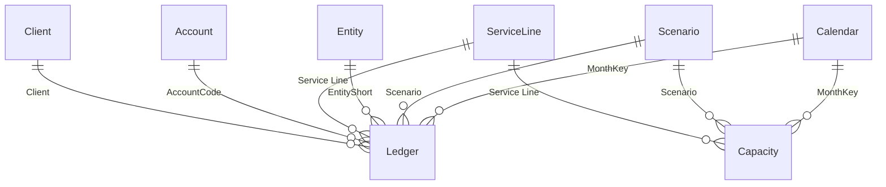

# Month-End Management Pack

A working Power BI finance report: a month-end management close with budget-vs-actual, a variance bridge and a drillable P&L. Built as a PBIP project, so the semantic model and DAX are readable here on GitHub.

> All data is synthetic and the client (Ashcombe Partners, a professional-services firm) is fictional. Every figure traces to the deterministic generator in [`generator/`](generator/).

## What it answers

| Page | Question |
|---|---|
| Month-End Scorecard | Did we hit the number this month, and where is the variance? |
| Profit Bridge | What drove operating profit from budget to actual? |
| P&L Matrix | The full management P&L, this month and year to date. |
| Client Portfolio | Where does revenue come from, and at what margin? |
| Service Line Detail | One service line end to end (drillthrough). |

The pack reports a single month (June 2026) against budget, with a year-to-date column. All figures are anchored to that fixed month, so the published numbers are stable.

## The idea that runs through it

**Every amount is stored as a signed profit contribution: revenue positive, costs negative.** Two things follow for free:

- `SUM(Amount)` is the profit at any level of the P&L (Revenue + Direct costs = Gross profit, and so on).
- **Variance = Actual - Budget carries the favourable/unfavourable sign for every line automatically.** A cost coming in under budget is a positive (favourable, green) variance; a revenue miss is negative (unfavourable, red). One colour rule, no special-casing. That is why the report never mistakes "positive number" for "good".

## Data model

A scenario-based star schema: two facts, six dimensions, and two disconnected presentation tables.

| Table | Grain | Rows |
|---|---|---|
| Ledger | Month x Scenario x Entity x Service Line x Account x Client | ~3,000 |
| Capacity | Month x Scenario x Service Line | 144 |
| Calendar / Scenario / Entity | dimensions | 18 / 2 / 3 |
| Service Line / Account / Client | dimensions | 5 / 14 / 14 |
| P&L Line / Bridge | disconnected (matrix layout, waterfall) | 16 / 7 |

**P&L Line** is a disconnected table that lays out the statement (Revenue, its accounts, Gross profit, Overheads, its accounts, Operating profit); a single `PL Amount` measure reads each line and returns the right figure, so subtotals sit in the correct positions with Month and Year-to-date column groups. **Bridge** drives the waterfall the same way. Full spec: [`docs/spec-month-end.md`](../docs/spec-month-end.md).

## Measures

~40 measures. Highlights:

- **Actual / Budget / Variance / Variance %** - scenario-filtered, with the signed-amount convention doing the favourable/unfavourable work; Variance % guards against a missing budget (returns blank, never a divide-by-zero).
- **YTD Actual / Budget / Variance** - year to date, computed at month grain with no daily date table.
- **Revenue, Gross Profit, Operating Profit** and their margins; **Utilisation %** from the capacity fact.
- **PL Amount** and the P&L-matrix measures that render the statement; **Bridge Value** for the waterfall.

## Deliberate data-quality wrinkles

Six realistic issues the model handles in the open:

| Wrinkle | Handling |
|---|---|
| Unbudgeted account (Depreciation) | Variance % returns blank; a measure counts the missing line |
| Duplicated journal batch | Deduped in Power Query |
| Dirty client names | Trimmed and resolved to the client master |
| Overhead rows with no client | Mapped to an explicit Unallocated member |
| A cost posted with the wrong sign | Coerced negative by account category at load |
| Sub-pound rounding rows | Absorbed once shown in thousands |

## Opening it

1. `node generator/generate-data.js` (no dependencies) writes the CSVs to [`data/`](data/).
2. Open `Month-End Management Pack.pbip` in Power BI Desktop; point the `Data Folder` parameter at your local `data` folder and refresh.

Design system: [`docs/design-reference-month-end.html`](../docs/design-reference-month-end.html).
