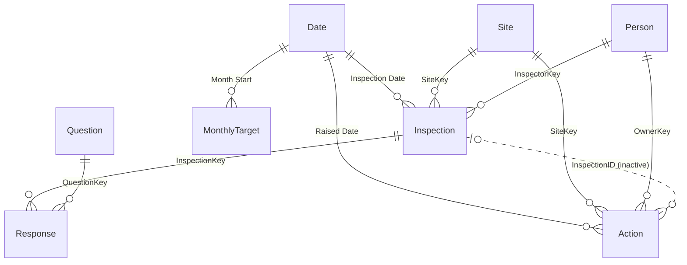

# Site Inspection Performance

A working Power BI report tracking a safety-and-compliance inspection programme across 42 sites. Built as a PBIP project, so the semantic model and DAX are readable here on GitHub.

> All data is synthetic and the client (Meridian Facilities Group) is fictional. Every figure traces to the deterministic generator in [`generator/`](generator/).

## What it answers

| Page | Question |
|---|---|
| Executive Overview | Are we inspecting enough, and is compliance on target? |
| Compliance Deep-Dive | What are we finding, and where does it repeat? |
| Action Tracker | Are corrective actions getting closed on time? |
| Coverage | Are we inspecting the right places often enough? |
| Inspection Detail | One inspection end to end (drillthrough). |

All time-based logic is anchored to a fixed as-at date (26 June 2026, the latest inspection), so the published numbers stay stable.

## Data model

A star schema: three facts, four dimensions, one target table.

| Table | Grain | Rows |
|---|---|---|
| Inspection | one inspection visit | 863 |
| Response | one checklist answer | 20,712 |
| Action | one corrective action | 484 |
| Site / Person / Question | dimensions | 42 / 11 / 24 |
| Date / MonthlyTarget | calendar / month | 546 / 18 |

Full column-level dictionary: [`docs/spec-site-inspection.md`](../docs/spec-site-inspection.md).

## Measures

~35 measures, grouped by folder. Highlights:

- **Compliance %** - one measure serving the trend, region ranking, heatmap and the detail-page score, so they always reconcile. Returns blank (not 0%) when nothing was inspected.
- **Coverage** - Days Since Last Inspection and Sites Not Visited 60d drive the staleness view, ignoring the date slicer.
- **Actions** - Closure Rate %, Actions Overdue, Max Days Overdue and Median Days to Close track the corrective-action lifecycle.

## Deliberate data-quality wrinkles

Six realistic issues the model handles in the open rather than hiding:

| Wrinkle | Handling |
|---|---|
| Uninspected site-months | Blank heatmap cells, never 0% |
| Duplicate export rows | Deduped in Power Query |
| N/A answers | Excluded from the compliance denominator |
| Orphan action | Kept and surfaced by a measure |
| Unassigned owners | Mapped to an explicit member |
| Dirty site names | Trimmed and resolved at load |

## Opening it

1. `node generator/generate-data.js` (no dependencies) writes the CSVs to [`data/`](data/).
2. Open `Site Inspection Performance.pbip` in Power BI Desktop; point the `Data Folder` parameter at your local `data` folder and refresh.

Design system: [`docs/design-reference-site-inspection.html`](../docs/design-reference-site-inspection.html).
